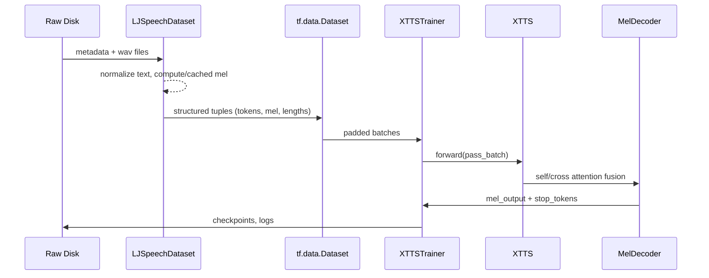

# End-to-End Data Journey in MyXTTSModel

This note walks through **every stage** a sample touches, from raw disk up to the model’s mel/stop predictions. References to implementation hot-spots are included so you can jump into code immediately.

---

## Bird’s-Eye Timeline

Use the timeline as a compass; the sections below expand each arrow into concrete steps.

---

## Stage 0 – Dataset Files on Disk
- **Where:** `data/` (custom) or the standard LJSpeech folder; metadata in `metadata_train.csv`, `metadata_eval.csv`.
- **Metadata columns:** sample identifier, relative wav path, raw transcription, normalized transcription, optional duration.
- **Audio format expectation:** mono 22.05 kHz WAV; MyXTTS converts any other sample rate on-the-fly during training.
- **Text encoding:** ASCII/UTF-8; later normalised via cleaner list in `DataConfig.text_cleaners` (defaults: `english_cleaners`).

---

## Stage 1 – Dataset Object Assembly
**File:** `myxtts/data/ljspeech.py`

1. `LJSpeechDataset.__init__` collects paths, config, subset name, and creates helper caches (text + mel).  (see `myxtts/data/ljspeech.py:37`)
2. `AudioProcessor` (sample rate, FFT sizes) and `TextProcessor` (tokeniser, language, cleaner) are instantiated once per dataset object.  (`ljspeech.py:66`)
3. `_prepare_dataset()` ensures the metadata file exists, optionally downloads data, and prepares internal indices.
4. If no custom metadata is provided, `_create_splits()` splits a single metadata file into train/val/test using ratios from `DataConfig`.

**Outputs of Stage 1:** an in-memory dataframe (`self.metadata`) plus indexing arrays (`self.items` or `_custom_index_map`) describing which rows belong to the active subset.

---

## Stage 2 – On-the-Fly Processing (No Preprocessing)
**Key methods:** `_load_sample`, `_load_tokens_optimized`

- All data processing is now done on-the-fly during training (no preprocessing or caching to disk).
- For mel spectrograms: each item loads the wav, normalizes if requested, converts to mel via `AudioProcessor.wav_to_mel` in real-time.
- For tokens: `TextProcessor.text_to_sequence` generates token ids on-demand with in-memory caching only.
- No disk caching or preprocessing steps are required - training works directly with raw WAV + CSV files.

**Outputs of Stage 2:** In-memory processed samples ready for training batches.

---

## Stage 3 – Building the `tf.data` Pipeline
**Function:** `LJSpeechDataset.create_tf_dataset` (`myxtts/data/ljspeech.py`)

1. **Source tensors:** `tf.data.Dataset.from_tensor_slices` creates dataset from sample indices.
2. **Shuffle early:** buffer size uses `batch_size * buffer_size_multiplier` (with caps) for better randomness.
3. **Parallel map:** `_load_sample_tf` uses `tf.numpy_function` to load and process samples on-the-fly concurrently (`num_parallel_calls=tf.data.AUTOTUNE`). Shapes are explicitly set to keep graph tracing stable.
4. **Length capping:** Applied during sample loading to enforce `DataConfig.max_mel_frames` and `max_text_tokens` if present.
5. **Filtering:** `dataset.filter` removes zero-length sequences early.
6. **Padding + batching:** `padded_batch` yields `[B, Tmax_txt]`, `[B, Tmax_mel, 80]`, `[B]`, `[B]`.
7. **Repeat & prefetch:** controlled by `repeat`, `prefetch_buffer_size`, and optional `tf.data.experimental.prefetch_to_device('/GPU:0', buffer_size=...)` when `prefetch_to_gpu=True`.
8. **Pipeline options:** `dataset.with_options` toggles `map_fusion`, `map_parallelization`, thread pools, etc., to reduce latency and host/GPU contention.

**Outputs of Stage 3:** a ready-to-iterate `tf.data.Dataset` producing padded mini-batches already shaped for the model.

---

## Stage 4 – Trainer Hooks the Dataset
**File:** `myxtts/training/trainer.py`

1. `XTTSTrainer.prepare_datasets` returns `(train_ds, val_ds)` and stores internal iterators.  (line `244`)
2. Dataset sizes are recorded to derive `default_steps_per_epoch`.
3. When multi-GPU is enabled, `strategy.experimental_distribute_dataset` wraps the dataset in a distributed form.
4. During training, `train_step` and `distributed_train_step` fetch batches lazily from the dataset.

**Key shapes at entry:**
- `text_sequences`: `int32[B, T_txt]`
- `mel_spectrograms`: `float32[B, T_mel, 80]`
- `text_lengths`, `mel_lengths`: `int32[B]`

---

## Stage 5 – Per-Batch Preparation inside `train_step`
**Function:** `XTTSTrainer.train_step` (`trainer.py:351`)

1. **Length guards:** slices sequences to `ModelConfig.max_attention_sequence_length` and `DataConfig.max_mel_frames` if defined.
2. **Device placement:** `ensure_gpu_placement` coerces tensors onto `/GPU:0`; the gradient tape and forward call also sit inside an explicit `tf.device` context.
3. **GradientTape:** created with default persistent behaviour; captures operations until loss calculation finishes.
4. **Forward call:** `self.model(...)` receives the batch (see next stage).

**Intermediates (on GPU):** truncated/padded copies of batch tensors ready for the model call.

---

## Stage 6 – Text Branch (Encoder)
**Class:** `TextEncoder` in `myxtts/models/xtts.py`

1. **Embedding:** `token_embedding` maps ids → `float32[B, T_txt, d_model]` and scales by `sqrt(d_model)`.
2. **Position encoding:** `PositionalEncoding` (sinusoidal) injects ordering information.
3. **Attention mask preparation:** `text_mask = sequence_mask(text_lengths)` → `[B, T_txt]`, expanded to `[B, 1, 1, T_txt]` with `0/-1e9` entries.
4. **Transformer stack:** `config.text_encoder_layers` repetitions of `TransformerBlock` with memory-efficient multi-head attention.
5. **Output norm:** `LayerNormalization` yields `text_encoded`.

**Output handed forward:** `text_encoded` `[B, T_txt, d_model]` (float32 or float16 if mixed precision).

---

## Stage 7 – Audio Branch (Optional Voice Conditioning)
**Class:** `AudioEncoder` (`xtts.py:134`)

1. **Convolutional trio:** extracts local temporal patterns from `mel_conditioning` `[B, T_ref, 80]`.
2. **Projection:** Dense → `audio_encoder_dim` to align dimensions with the decoder.
3. **Transformer stack:** similar to text branch, preserving time axis.
4. **Speaker embedding:** `GlobalAveragePooling1D` + Dense(`tanh`) → `[B, speaker_embedding_dim]`.

**Outputs:**
- `audio_encoded` `[B, T_ref, audio_encoder_dim]` for cross-attention.
- `speaker_embedding` `[B, speaker_dim]` broadcast later into the decoder.

If `ModelConfig.use_voice_conditioning=False`, this entire stage is skipped and downstream logic must accept `None` embeddings.

---

## Stage 8 – Decoder Input Conditioning
**Site:** `XTTS.call` (`xtts.py:283`)

1. **Teacher forcing:** during training, `mel_inputs` shifts right by one frame (`tf.pad`), producing `[B, T_mel, 80]` with a leading all-zero frame.
2. **Inference alternative:** in `XTTS.generate`, the first frame starts as zeros and grows autoregressively.
3. **Causal mask:** `tf.linalg.band_part` builds `[T_mel, T_mel]` lower-triangular mask, tiled to `[B, T_mel, T_mel]`; combined with padding mask when `mel_lengths` are present.

**Result:** `decoder_inputs`, `causal_mask`, and `text_mask`/`audio_mask` are ready for the decoder stack.

---

## Stage 9 – Mel Decoder Fusion
**Class:** `MelDecoder` (`xtts.py:192`)

1. **Dense projection:** `decoder_inputs` → `decoder_dim`.
2. **Speaker concat (optional):** `speaker_embedding` is tiled to `[B, T_mel, speaker_dim]`, concatenated, then projected back to `decoder_dim`.
3. **Positional encoding + dropout:** ensures time-awareness and regularization.
4. **Transformer blocks:** each block performs
   - **Self-attention:** respects `decoder_mask` to enforce autoregressive behaviour.
   - **Cross-attention:** queries on decoder states, keys/values from `text_encoded` (and implicitly uses `encoder_mask`).
5. **Final projections:**
   - `mel_projection` → predicted mel frames `[B, T_mel, 80]`.
   - `stop_projection (sigmoid)` → `[B, T_mel, 1]` stop probabilities.

**Outputs merged into dictionary:** `{"mel_output", "stop_tokens", "text_encoded", (optional) "speaker_embedding"}`.

---

## Stage 10 – Loss Assembly & Backward Pass
**File:** `myxtts/training/trainer.py` & `myxtts/training/losses.py`

1. `create_stop_targets` builds a binary mask (`1` at and after the target stop frame). Shape: `[B, T_mel, 1]`.
2. `y_true`/`y_pred` dictionaries are fed into `XTTSLoss.__call__`, which internally computes:
   - **Mel loss:** Huber/L1 hybrid with optional label smoothing, masked by `mel_lengths`. (`losses.py:13`)
   - **Stop loss:** weighted BCE with positive class emphasis. (`losses.py:54`)
   - **Attention & duration losses:** encourage monotonic alignments and accurate frame counts.
3. **Gradient scaling:** if mixed precision is active, `LossScaleOptimizer` rescales losses before `tape.gradient`.
4. **Gradient computation:** `gradients = tape.gradient(total_loss, model.trainable_variables)`.
5. **Optional accumulation:** if `gradient_accumulation_steps > 1`, gradients are temporarily stacked and applied less frequently (handled inside the trainer logic not shown here).
6. **Optimizer update:** `optimizer.apply_gradients(zip(gradients, variables))` with optional `global_clipnorm` from config.
7. **Metrics capture:** `criterion.get_losses()` exposes per-component losses plus `gradient_norm` and stability heuristics.

**Outputs of Stage 10:** updated model weights, logged scalars, and cleaned-up temporary tensors.

---

## Stage 11 – Scheduler, Logging, and Checkpoints
- **Learning rate scheduler:** created in `_create_lr_scheduler` (Noam, cosine, exponential). For Noam, the schedule depends on `text_encoder_dim` and `warmup_steps`.
- **Early stopping:** monitors validation loss with `patience`/`min_delta` (`trainer.py:121`).
- **Checkpointing:** `save_checkpoint` persists model weights, optimizer state, scheduler state to `config.training.checkpoint_dir` whenever `step % save_step == 0` or at training end.
- **WandB logging (optional):** if `use_wandb=True`, metrics are streamed each `log_step`.

---

## Stage 12 – Autoregressive Inference Loop
**Function:** `XTTS.generate` (`xtts.py:333`)

1. Text (and optional reference audio) is encoded exactly as in Stages 6–7.
2. Initialise `current_mel = zeros([B, 1, n_mels])`.
3. For each step up to `max_length`:
   - Run `mel_decoder` on the accumulated frames.
   - Take the last frame `mel_frame` and stop probability `stop_prob`.
   - Append `mel_frame` to `current_mel`.
   - Break when **all** stop probabilities exceed 0.5 (threshold tunable).
4. Concatenate collected frames into `[B, T_generated, 80]`; return along with stop probabilities and conditioning embeddings.

**Next typical stage (outside this repo):** pass `mel_output` into a neural vocoder (e.g., HiFi-GAN) to synthesize waveform audio.

---

## Shape & Dtype Cheat Sheet
| Tensor | Shape | Dtype | Produced At |
|--------|-------|-------|-------------|
| `text_sequences` | `[B, T_txt]` | `int32` | `tf.data` pipeline (Stage 3) |
| `mel_spectrograms` | `[B, T_mel, 80]` | `float32` | `tf.data` pipeline |
| `text_encoded` | `[B, T_txt, d_model]` | `float16/32` | Text encoder (Stage 6) |
| `audio_encoded` | `[B, T_ref, d_audio]` | `float16/32` | Audio encoder (Stage 7) |
| `speaker_embedding` | `[B, speaker_dim]` | `float16/32` | Audio encoder |
| `decoder_inputs` | `[B, T_mel, 80]` | `float32` | Stage 8 |
| `mel_output` | `[B, T_mel, 80]` | `float32` | Stage 9 |
| `stop_tokens` | `[B, T_mel, 1]` | `float32` | Stage 9 |
| `stop_targets` | `[B, T_mel, 1]` | `float32` | Stage 10 |

---

## Debug Checklist (Quick Reminders)
- **Data loading:** all processing is on-the-fly; ensure WAV files and CSV metadata are valid and accessible.
- **Shape mismatches:** compare dataset output shapes with `ModelConfig.n_mels`, `max_text_length`, `max_attention_sequence_length`.
- **Voice conditioning:** either supply `audio_conditioning` every batch or set `use_voice_conditioning=False`.
- **OOM mitigation:** tighten `max_mel_frames`, reduce batch size, or bump `gradient_accumulation_steps`.
- **Gradient spikes:** watch `gradient_norm` metric; if it explodes, inspect latest batches for very long sequences or corrupted audio files.

---

## Where to Go Next
1. Add a Mermaid `classDiagram` to visualise object relationships (`Trainer ↔ Dataset ↔ Model`).
2. Create HTML from this Markdown via `pandoc` and enhance with interactive tensor inspectors (JS + CSS).
3. Extend the cheat sheet with downstream vocoder expectations if audio synthesis is part of your pipeline.
