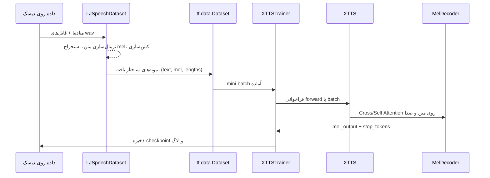

# گام‌به‌گام جریان داده از ورودی تا خروجی در MyXTTSModel

این سند فرآیند حرکت داده را از لحظه‌ای که فایل‌های متنی/صوتی وارد پایپ‌لاین می‌شوند تا زمانی که خروجی مدل (mel spectrogram و stop tokens) تولید می‌شود، به‌صورت مرحله‌به‌مرحله توضیح می‌دهد. ارجاع‌ها به فایل‌های اصلی پروژه آورده شده‌اند تا بتوانید به سادگی مسیر را در کد دنبال کنید.

---

## نمای زمانی (Timeline) فشرده

---

## مرحله ۱: خواندن و آماده‌سازی دیتاست
1. **بارگذاری متادیتا و فایل‌ها** (`myxtts/data/ljspeech.py`):
   - در سازنده‌ی `LJSpeechDataset`, مسیرهای csv (`metadata_train.csv` یا `metadata_eval.csv`) و پوشه‌ی `wavs/` مشخص می‌شوند.
   - صدا توسط `AudioProcessor` به نمونه‌های 22.05kHz و 80 مل تبدیل می‌شود؛ متن با `TextProcessor` پاکسازی و توکنیزه می‌گردد.
2. **پیش‌پردازش و کش**: بسته به `DataConfig.preprocessing_mode`، فرمان‌هایی مثل `precompute_mels` و `precompute_tokens` اجرا می‌شوند تا mel و توکن‌ها ذخیره شوند.
3. **تشکیل splitها**: اگر از متادیتای پیش‌فرض استفاده شود، فایل `splits.json` ایجاد شده و اندیس‌های train/val جدا می‌شوند.

**خروجی این مرحله**: لیستی از نمونه‌ها که هر کدام شامل مسیر فایل صوتی، متن نرمال شده، حاشیه‌ی زمانی و متادیتای کمکی است.

---

## مرحله ۲: ساخت `tf.data.Dataset`
1. تابع `create_tf_dataset` در `LJSpeechDataset` برای هر زیرمجموعه صدا و متن را به `tf.data.Dataset` برمی‌گرداند.
2. عملیات کلیدی pipeline:
   - `shuffle(buffer)` با ضریب `shuffle_buffer_multiplier`.
   - `map` برای بارگذاری/کشیدن mel و توکن.
   - `padded_batch` برای یکدست کردن طول متن و mel (پد کردن با صفر).
   - `prefetch` و در صورت فعال بودن `prefetch_to_gpu`، انتقال بافری به GPU.
3. این دیتاست در `XTTSTrainer.prepare_datasets` فراخوانی شده و برای train و val تنظیم می‌شود (`myxtts/training/trainer.py:244`).

**خروجی این مرحله**: generatorی که هر بار یک batch شامل `(text_ids, mel_frames, text_lengths, mel_lengths)` تولید می‌کند. شکل‌ها:
- `text_ids`: `[B, T_txt]`
- `mel_frames`: `[B, T_mel, 80]`
- `text_lengths`, `mel_lengths`: `[B]`

---

## مرحله ۳: ورود batch به لوپ آموزش
1. `XTTSTrainer.train_step` (یا `distributed_train_step`) mini-batch را دریافت می‌کند (`myxtts/training/trainer.py:351`).
2. پیش از ورود به مدل:
   - در صورت تعریف `max_attention_sequence_length` یا `max_mel_frames`, طول‌ها کپ می‌شوند تا از OOM جلوگیری شود.
   - با `ensure_gpu_placement` تنسورها به GPU منتقل می‌شوند.
3. `GradientTape` فعال می‌شود تا گرادیان‌ها محاسبه شوند.

**خروجی موقت**: همان batch آماده که روی GPU قرار دارد و آماده‌ی forward است.

---

## مرحله ۴: عبور از Text Encoder
1. فراخوانی `self.model(...)` باعث اجرای `XTTS.call` می‌شود (`myxtts/models/xtts.py:246`).
2. `text_encoder` ورودی متنی را فرآوری می‌کند:
   - Embedding + positional encoding → `text_encoded` با شکل `[B, T_txt, d_model]`.
   - ماسک‌های attention از `text_lengths` ساخته می‌شوند تا padding دیده نشود.
3. اگر `use_voice_conditioning=True`, مسیر صوتی موازی برای تولید `audio_encoded` و `speaker_embedding` فعال می‌گردد.

**خروجی این مرحله**: تنسور زمینه‌ای متن و در صورت فعال بودن، بردار گوینده.

---

## مرحله ۵: آماده‌سازی ورودی رمزگشا
1. در حالت آموزش (teacher forcing)، `mel_inputs` یک گام به عقب شیفت می‌شوند (`myxtts/models/xtts.py:303`).
2. ماسک علّی با `tf.linalg.band_part` ساخته می‌شود تا هر فریم فقط گذشته‌ی خود را ببیند (`causal_mask`).
3. اگر `mel_lengths` داده شده باشد، padding در ماسک لحاظ می‌شود تا روی فریم‌های خالی attention نشود.

**خروجی**: `decoder_inputs` با شکل `[B, T_mel, 80]` و `causal_mask` در ابعاد `[B, T_mel, T_mel]`.

---

## مرحله ۶: Mel Decoder و ترکیب اطلاعات
1. در `MelDecoder.call` (`myxtts/models/xtts.py:207`):
   - `decoder_inputs` به `decoder_dim` پرجکت می‌شود.
   - اگر `speaker_embedding` موجود باشد، به هر time-step الصاق و دوباره به همان فضا نگاشته می‌شود.
   - positional encoding و dropout اعمال می‌گردد.
2. بلاک‌های ترنسفورمر داخل رمزگشا دو جریان توجه دارند:
   - Self-Attention با ماسک علّی.
   - Cross-Attention روی `text_encoded` و در صورت فعال بودن، `audio_encoded`.
3. خروجی نهایی:
   - `mel_projection` → `[B, T_mel, 80]`
   - `stop_projection` → `[B, T_mel, 1]`

**نتیجه‌ی مستقیم مدل**: dict با کلیدهای `mel_output`, `stop_tokens`, و در صورت موجود بودن `speaker_embedding`.

---

## مرحله ۷: محاسبه‌ی Loss و انتشار معکوس
1. در `train_step` پس از دریافت خروجی مدل:
   - `create_stop_targets` بردار لبه‌ی توقف را از `mel_lengths` می‌سازد (`myxtts/training/losses.py`).
   - دیکشنری `y_true` و `y_pred` به `XTTSLoss.__call__` پاس داده می‌شود تا lossهای mel، stop، attention و duration ترکیب شوند.
2. `tape.gradient(loss, model.trainable_variables)` گرادیان‌ها را می‌سازد و در صورت استفاده از mixed precision، داخل `LossScaleOptimizer` به سطح قبلی برگردانده می‌شود.
3. `optimizer.apply_gradients` وزن‌ها را به‌روزرسانی می‌کند؛ سپس معیارهایی مانند `gradient_norm` برای نظارت ثبت می‌شوند.

**خروجی این مرحله**: ضرایب loss و وضعیت به‌روزشده‌ی مدل.

---

## مرحله ۸: پس‌پردازش و ثبت خروجی
1. اگر گام فعلی به آستانه‌ی `save_step` رسید، `XTTSTrainer` با `save_checkpoint` وزن‌ها و optimizer را در مسیر `checkpoint_dir` ذخیره می‌کند.
2. مقادیر ثبت‌شده شامل `mel_loss`, `stop_loss`, `gradient_norm` و سایر معیارهای پایداری هستند؛ در صورت فعال بودن `wandb`, این مقادیر به داشبورد ارسال می‌شود.
3. حلقه‌ی آموزش تا رسیدن به `epochs` یا شرط توقف زودهنگام (`EarlyStopping`) ادامه دارد.

**نتیجه نهایی**: مدل وزن‌گذاری‌شده در مسیر checkpoint، به‌همراه لاگ‌های روند یادگیری.

---

## حالت تولید (Inference)
- `XTTS.generate` (`myxtts/models/xtts.py:333`) مراحل ۴ تا ۶ را با تفاوت‌های زیر تکرار می‌کند:
  1. ورودی رمزگشا با فریم صفر شروع می‌شود و در هر گام فریم قبلی به آن اضافه می‌گردد.
  2. حلقه‌ی خودبازگشتی تا زمانی ادامه دارد که `stop_tokens` بالای آستانه باشد یا به `max_length` برسد.
  3. خروجی نهایی، دنباله‌ای از mel spectrogramها و بردار `stop_probs` است که برای تبدیل به موج صوتی (مثلاً با vocoder) آماده‌اند.

---

## چک‌لیست دیباگ مسیر داده
- مطمئن شوید شکل‌های تولیدشده توسط `tf.data` با `ModelConfig` همخوانی دارد؛ تفاوت در `n_mels` یا `max_text_length` باعث خطا می‌شود.
- در صورت فعال بودن voice conditioning، با `audio_conditioning is None` به مدل ورودی ندهید؛ یا `use_voice_conditioning=False` تنظیم کنید.
- اگر gradient norm به‌طور مداوم بالا است، مقادیر `max_mel_frames` یا `batch_size` را کاهش دهید تا طول توالی کنترل شود.
- برای بررسی سریع، می‌توانید یک batch را به‌صورت دستی از دیتاست بگیرید و مراحل ۴ تا ۶ را در نوت‌بوک اجرا کنید تا شکل تنسورها را ببینید.

---

### مسیرهای تکمیلی پیشنهاد شده
1. افزودن Mermaid classDiagram جهت نمایش کلاس‌های `XTTSTrainer`, `LJSpeechDataset`, `XTTS` و ارتباط آن‌ها.
2. توسعه‌ی سناریوهای «وقتی این خطا رخ داد چه کنیم» با تمرکز بر mismatch طول‌ها، OOM و خرابی کش.
3. تبدیل این سند به HTML همراه با اینتراکتیو JS برای نمایش تنسورها در هر مرحله.
