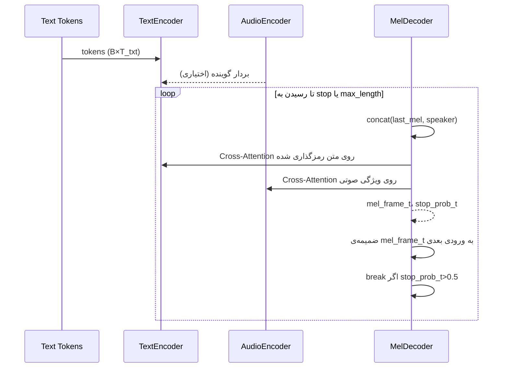

# جریان داده داخلی MyXTTSModel

این یادداشت بر تمرکز روی مسیر حرکت داده داخل کلاس `myxtts/models/xtts.py` دارد و هر مرحله‌ی رمزگذار/رمزگشا را به‌صورت تصویری و متن توضیح می‌دهد. هدف این است که هنگام شخصی‌سازی یا دیباگ مدل، بدانید هر تنسور در کجا تولید و به چه شکلی مصرف می‌شود.

---

## ۱. نقشه کلی جریان داده
```mermaid
flowchart LR
    subgraph Text Path
        A[Token IDs<br/>B×T_txt] --> B[Embedding & Scaling
(token_embedding)]
        B --> C[PositionalEncoding]
        C --> D[Stacked Transformer Blocks]
        D --> E[text_encoded
B×T_txt×d_model]
    end

    subgraph Audio Path
        F[Reference Mel spectrogram<br/>B×T_ref×80] --> G[Conv Stack]
        G --> H[Projection→d_audio]
        H --> I[Transformer Blocks]
        I --> J[(Contextual Audio Features)]
        I --> K[speaker_embedding
B×d_spk]
    end

    subgraph Decoder
        L[Shifted Target Mel frames<br/>B×T_mel×80] --> M[Input Projection]
        M --> N[Concat Speaker (اختیاری)]
        N --> O[PositionalEncoding]
        O --> P[Decoder Transformer Blocks
(با Self & Cross Attention)]
        P --> Q[Mel Projection
B×T_mel×80]
        P --> R[Stop Token Projection
B×T_mel×1]
    end

    E -. Cross Attention .-> P
    J -. Cross Attention .-> P
    K -. Conditioning .-> N
```

---

## ۲. مسیر متن (Text Encoder)
- **منبع**: `XTTS.text_encoder` در فایل `myxtts/models/xtts.py:91`.
- **گام‌ها**:
  1. تعبیه‌ی توکن‌ها (`token_embedding`) با ابعاد `d_model`.
  2. ضرب در `sqrt(d_model)` به‌عنوان نرمال‌سازی مقیاس.
  3. تزریق آدرس‌دهی مکانی (PositionalEncoding) تا مدل ترتیب را بداند.
  4. گذر از `text_encoder_layers` عدد بلاک ترنسفورمر (Self-Attention + FeedForward).
  5. نرمال‌سازی لایه‌ای نهایی برای تثبیت خروجی.
- **ماسک توجه**: اگر طول واقعی متن (`text_lengths`) داده شود، `sequence_mask` تولید شده و به self-attention اعمال می‌شود تا توجه روی padding بسته شود.

### اشکال مهم متن
| تنسور | شکل (Shape) | توضیح |
|-------|--------------|--------|
| `text_inputs` | `[B, T_txt]` | توکن‌های ورودی (int32). |
| `text_encoded` | `[B, T_txt, d_model]` | نمایش زمینه‌ای شده؛ ورودی مستقیم به رمزگشا. |

---

## ۳. مسیر صوت (Audio Encoder)
- **منبع**: `AudioEncoder.call` در `myxtts/models/xtts.py:149`.
- **گام‌ها**:
  1. اسپکتروگرام مرجع (`mel_reference`) وارد سه لایه‌ی کانولوشن ۱بعدی می‌شود تا ویژگی‌های محلی استخراج شود.
  2. خروجی کانولوشن‌ها با Dense به فضای `audio_encoder_dim` نگاشت می‌شود.
  3. چند بلاک ترنسفورمر دیگر برای گرفتن وابستگی‌های بلندمدت اعمال می‌شود.
  4. خروجی دنباله علاوه بر یک تنسور زمینه‌ای، توسط `GlobalAveragePooling1D` فشرده شده و به `speaker_embedding` تبدیل می‌شود (`tanh` برای فشرده‌سازی بردار).
- **نقش**: `speaker_embedding` به رمزگشا تزریق می‌شود و مسیر توالی‌ای (`audio_encoded`) برای Cross-Attention موجود است.

| تنسور | شکل | توضیح |
|--------|------|--------|
| `audio_conditioning` | `[B, T_ref, n_mels]` | اسپکتروگرام مرجع (معمولاً 80 مل). |
| `audio_encoded` | `[B, T_ref, audio_encoder_dim]` | ویژگی‌های زمان‌دار برای Cross-Attention. |
| `speaker_embedding` | `[B, speaker_embedding_dim]` | بردار شناسه‌ی گوینده. |

---

## ۴. آماده‌سازی ورودی رمزگشا
- **Teacher Forcing**: در آموزش، تنسور `mel_inputs` یک گام به عقب شیفت داده می‌شود (`tf.pad` در `XTTS.call` سطر `317`)، تا مدل همیشه فریم صحیح قبلی را ببیند.
- **Inference**: در `XTTS.generate` (سطر `349`)، آموزش خودبازگشتی انجام می‌شود و ابتدا فریم صفر تزریق می‌گردد.
- **ماسک علّی**: `causal_mask` با `tf.linalg.band_part` ساخته می‌شود تا رمزگشا فقط فریم‌های گذشته را ببیند؛ در صورت وجود `mel_lengths`، padding نیز صفر می‌شود.

---

## ۵. رمزگشایی (Mel Decoder)
- **منبع**: `MelDecoder.call` در `myxtts/models/xtts.py:192`.
- **ترکیب اطلاعات**:
  1. `decoder_inputs` با Dense به `decoder_dim` نگاشت می‌شود.
  2. اگر `speaker_embedding` وجود داشته باشد، به هر فریم الحاق و سپس با Dense دیگر هم‌دستگاه می‌شود.
  3. آدرس‌دهی مکانی و دراپ‌آوت اعمال می‌شود.
  4. هر بلاک ترنسفورمر دو مسیر توجه دارد:
     - Self-Attention با ماسک علّی (`decoder_mask`).
     - Cross-Attention روی خروجی متن (`encoder_output`) و در صورت فعال بودن، ویژگی صوتی.
  5. در انتها دو پروجکشن موازی:
     - `mel_projection`: پیش‌بینی اسپکتروگرام.
     - `stop_projection`: احتمال پایان گفتار.

| تنسور | شکل | توضیح |
|-------|------|--------|
| `decoder_inputs` | `[B, T_mel, n_mels]` | فریم‌های هدف شیفت داده شده. |
| `mel_output` | `[B, T_mel, n_mels]` | خروجی پیش‌بینی‌شده. |
| `stop_tokens` | `[B, T_mel, 1]` | احتمال توقف تولید. |

---

## ۶. شبه‌کد جریان کامل در حالت آموزش
```text
text_mask  = sequence_mask(text_lengths)
mel_mask   = sequence_mask(mel_lengths)

text_repr  = TextEncoder(text_inputs, mask=text_mask)

if use_voice_conditioning:
    audio_repr, speaker_vec = AudioEncoder(audio_conditioning)
else:
    audio_repr, speaker_vec = None, None

decoder_in = shift_right(mel_inputs)
causal_mask = build_causal_mask(mel_mask)

mel_pred, stop_pred = MelDecoder(
    decoder_in,
    encoder_output=text_repr,
    speaker_embedding=speaker_vec,
    encoder_mask=text_mask,
    decoder_mask=causal_mask
)
```

---

## ۷. جریان خودبازگشتی در حالت تولید


- هر فریم خروجی دوباره وارد رمزگشا می‌شود و شرط توقف با `stop_prob` کنترل می‌گردد.
- `temperature` در تابع `generate` امکان کنترل تنوع خروجی را فراهم می‌کند (با تقسیم فریم قبل از خروجی).

---

## ۸. نقاط حساس برای دیباگ جریان داده
- **Mismatch شکل‌ها**: بررسی کنید `n_mels` بین داده و پیکربندی یکسان باشد. هر تفاوتی باعث خطای Dense خواهد شد.
- **ماسک‌ها**: اگر `text_lengths` یا `mel_lengths` نامعتبر باشند، attention روی padding باز می‌شود و کیفیت افت می‌کند.
- **Voice Conditioning خاموش/روشن**: وقتی `config.use_voice_conditioning=False` باشد، مسیر صوتی حذف و تزریق speaker انجام نمی‌شود؛ این حالت باید در داده نیز لحاظ شود.
- **Gradient Checkpointing**: تنظیم `enable_gradient_checkpointing` جریان داده را تغییر نمی‌دهد اما مصرف حافظه‌ی بلاک‌های ترنسفورمر را کاهش می‌دهد.

---

## ۹. ارتباط با Trainer
- `XTTSTrainer.prepare_datasets` تنسورهای زیر را تولید می‌کند: `text_inputs`, `mel_inputs`, `audio_conditioning`, `text_lengths`, `mel_lengths`.
- این تنسورها بدون تغییر ساختاری وارد `XTTS.call` می‌شوند؛ بنابراین هر تغییری در pipeline داده باید با جریان بالا سازگار باشد.

---

### پیشنهاد توسعه‌ی سند
- برای جزئیات بیشتر می‌توانید از Mermaid classDiagram جهت نمایش صریح کلاس‌ها و متدهای کلیدی استفاده کنید.
- اگر نیاز به نسخه HTML دارید، با `pandoc -s -o internal_flow.html MyXTTSModel_Internal_Data_Flow.md` می‌توانید خروجی وب با CSS سفارشی بگیرید.
