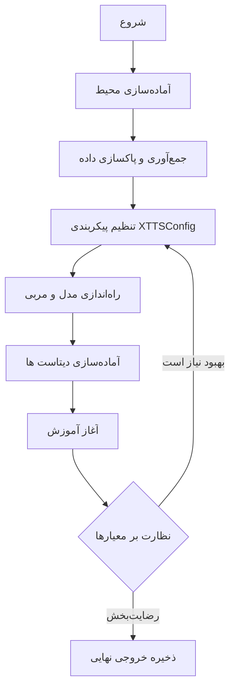
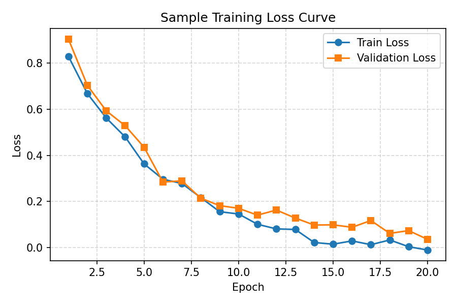
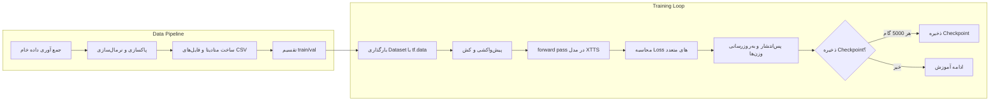

# MyXTTSModel Training Tutorial

این سند یک راهنمای آموزشی مرحله‌به‌مرحله برای درک و اجرای فرآیند آموزش مدل MyXTTS است. ساختار راهنما همراست با اسکریپت `train_main.py` و نوت‌بوک `MyXTTSTrain.ipynb` آماده شده تا بتوانید به سرعت جریان کلی، جزئیات مهم و نقاط قابل شخصی‌سازی را دنبال کنید.

---

## نقشه مفهومی سریع



---

## گام ۱: آماده‌سازی محیط
- نصب وابستگی‌ها با استفاده از `requirements.txt`:
  ```bash
  pip install -r requirements.txt
  ```
- تنظیم متغیرهای محیطی مربوط به GPU (در صورت نیاز)، برای مثال فعال کردن رشد پویا حافظه TensorFlow در اسکریپت به صورت پیش‌فرض انجام شده است (`TF_FORCE_GPU_ALLOW_GROWTH=true`).

## گام ۲: آماده‌سازی داده
- ساختار پیش‌فرض انتظار دارد که داده‌ها به صورت `metadata_train.csv`, `metadata_eval.csv` و پوشه `wavs/` در مسیرهای `--train-data` و `--val-data` قرار داشته باشند.
- با اجرای دستور زیر می‌توانید داده‌ها را پیش‌پردازش و اعتبارسنجی کنید:
  ```bash
  python examples/prepare_dataset.py --input raw_dataset --output data/processed
  ```
  *(اسکریپت نمونه؛ مسیر و نام فایل را متناسب با پروژه‌ی خود به‌روزرسانی کنید.)*

## گام ۳: تنظیم پیکربندی
- تابع `build_config` در `train_main.py` سه بخش اصلی را می‌سازد:
  - `ModelConfig`: ابعاد رمزگذار متن/صدا، اندازه واژگان، تنظیمات توجه و بهینه‌سازی حافظه.
  - `DataConfig`: اندازه‌ی مینی‌بتچ، تعداد Workerها، بافرهای پیش‌واکشی و گزینه‌های بهینه‌سازی ورودی.
  - `TrainingConfig`: نرخ یادگیری، تعداد epoch، تنظیمات شیب‌گیری و مسیر فایل‌های Checkpoint.
- در زمان اجرا، اسکریپت به صورت خودکار و بر اساس حافظه‌ی GPU شما، مقدار Batch Size، تعداد Worker و Gradient Accumulation را پیشنهاد می‌دهد.

## گام ۴: اجرای آموزش
- ساده‌ترین دستور برای شروع:
  ```bash
  python train_main.py \
    --train-data /path/to/dataset_train \
    --val-data /path/to/dataset_eval \
    --checkpoint-dir ./checkpoints_main
  ```
- برای کنترل دقیق‌تر می‌توانید پارامترهایی مثل `--epochs`, `--batch-size`, `--lr` و `--grad-accum` را تغییر دهید.

## گام ۵: پایش و تحلیل
- نقاط ثبت‌شده با `log_step` و `val_step` امکان نظارت بر روند آموزش را فراهم می‌کند.
- نمودار زیر نمونه‌ای از رفتار کاهش خطا در طول زمان است:



---

## شبه‌کد الگوریتم آموزش
```text
function train_xtts(train_path, val_path, args):
    config = build_config(overrides=args)
    model = XTTS(config.model)
    trainer = XTTSTrainer(config, model)

    train_ds, val_ds = trainer.prepare_datasets(train_path, val_path)

    for epoch in range(config.training.epochs):
        for batch in train_ds:
            loss = trainer.train_step(batch)
            if trainer.should_log():
                log_metrics(loss, trainer.current_step)

        if trainer.should_validate(epoch):
            val_metrics = trainer.validate(val_ds)
            adjust_scheduler(val_metrics)

    trainer.save_checkpoint("checkpoints/final_model")
    return trainer.summary()
```

---

## فلوچارت فرآیند آموزش جزئی


---

## مثال سناریوی عملی
1. GPU با ۲۴ گیگابایت حافظه دارید؛ اسکریپت به‌طور خودکار `batch_size=48`، `grad_accum=2` و `num_workers=10` را پیشنهاد می‌دهد.
2. داده‌ی آموزش و اعتبارسنجی را در پوشه‌های `data/tts_train` و `data/tts_val` قرار می‌دهید.
3. دستور زیر را اجرا می‌کنید:
   ```bash
   python train_main.py --train-data data/tts_train --val-data data/tts_val --epochs 150
   ```
4. از طریق خروجی لاگ متوجه می‌شوید که در گام 20٬000 مقدار `mel_loss` ثابت مانده است؛ با کاهش نرخ یادگیری به `2e-5` و ادامه آموزش، دقت مدل بهبود می‌یابد.
5. در پایان، Checkpoint نهایی در `checkpoints_main/final_model` ذخیره شده و برای استقرار یا Fine-tune آماده است.

---

## منابع تکمیلی پیشنهادی
- فایل `docs/ARCHITECTURE.md` برای درک اجزای مدل XTTS.
- اسکریپت‌های `validate_gpu_optimization.py` و `validate_memory_fixes.py` جهت ارزیابی عملکرد و مدیریت حافظه پس از آموزش.
- یادداشت‌ها و نکات ثبت‌شده در `PRODUCTION_TRAINING_GUIDE.md` برای آماده‌سازی نسخه تولیدی.

---

### سفارشی‌سازی بیشتر
- می‌توانید نمودارهای جدید، تصاویر آزمایشی و توضیحات شخصی خود را در همین پوشه و با استفاده از CSS/JS اضافه کنید. اگر به قالب HTML نیاز دارید، می‌توانید از ابزارهایی مثل `pandoc` برای تبدیل این سند به فایل وب با استایل اختصاصی بهره ببرید.
